<!-- Generated by GitHub Profile Agent Console. Edit profile.config.json, then run npm run generate. -->

  <picture>
    <source media="(max-width: 760px) and (prefers-color-scheme: dark)" srcset="./assets/hero/agent-console-5d58ea7c-mobile-dark.svg">
    <source media="(max-width: 760px)" srcset="./assets/hero/agent-console-5d58ea7c-mobile-light.svg">
    <source media="(prefers-color-scheme: dark)" srcset="./assets/hero/agent-console-5d58ea7c-dark.svg">
    <source media="(prefers-color-scheme: light)" srcset="./assets/hero/agent-console-5d58ea7c-light.svg">
    
  </picture>

  
  

## About Me

Agents that execute. Systems that settle.

## Current Focus

| Area | What I am exploring |
| --- | --- |
| **Agents** | Autonomous execution systems |
| **Settlement** | Chain-native rails |
| **Tooling** | Open source builders |

## Featured Work

| Project | Focus | Why it matters |
| --- | --- | --- |
| [**—**](https://github.com/0xrumora) | — | — |

## Research Direction

Interested in systems that observe, act, and settle autonomously.

## Tech Stack

`JavaScript` · `Python` · `Solidity`

---

  Let the activity speak.

